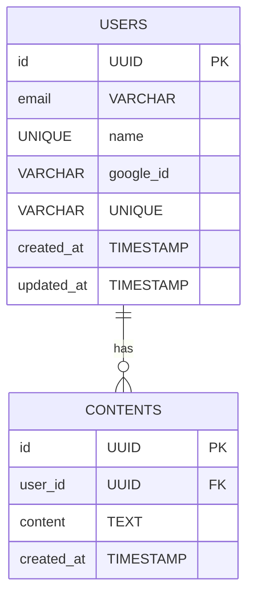
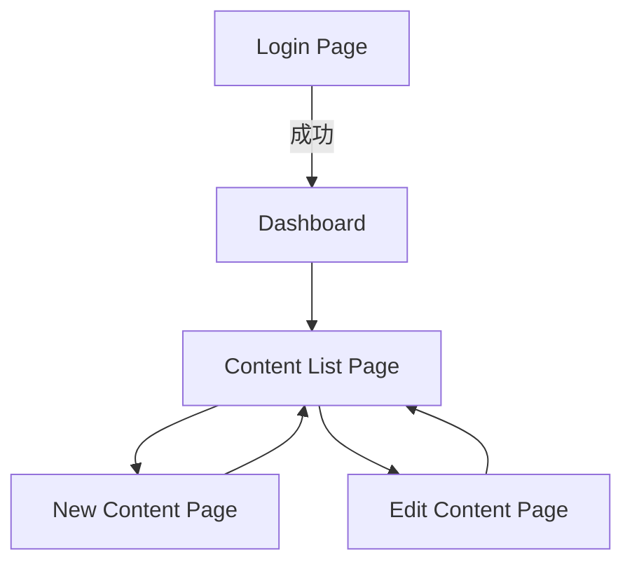

# OAuth Training プロジェクト 設計書

## 1. プロジェクト概要

* Google OAuth を利用したユーザー認証付きの Web アプリケーションを構築
* ユーザー登録・ログイン機能、DB からのデータ取得・表示、画面からのデータ登録・編集・削除

## 2. 技術スタック

* バックエンド: Go (Gin)
* フロントエンド: React + TypeScript (Chakra UI)
* データベース: PostgreSQL
* 認証: Google OAuth 2.0
* CI/CD: GitHub Actions

## 3. システムアーキテクチャ

```
[Browser] ⇄ [React Frontend] ⇄ [Gin API Server] ⇄ [PostgreSQL]
```

* 認証状態管理: HTTPOnly Cookie (セッション) または JWT

## 4. 認証フロー

1. フロントの「Googleでログイン」ボタン押下
2. `/auth/google/login` エンドポイントへリダイレクト
3. サーバー側で OAuth 認証 URL 生成 → Google
4. Google 認証後、`/auth/google/callback` でアクセストークン受け取り
5. ユーザー情報取得後、DB に登録／更新
6. セッション Cookie 発行または JWT をレスポンス
7. フロントで認証済み画面へリダイレクト

## 5. データベース設計

アプリで扱うテーブル構造（ER 図）



### テーブル定義例

```sql
-- ユーザー情報
CREATE TABLE users (
  id UUID PRIMARY KEY DEFAULT gen_random_uuid(),
  email VARCHAR(255) NOT NULL UNIQUE,
  name VARCHAR(100),
  google_id VARCHAR(100) UNIQUE,
  created_at TIMESTAMP NOT NULL DEFAULT now(),
  updated_at TIMESTAMP NOT NULL DEFAULT now()
);

-- ユーザー紐づきコンテンツ
CREATE TABLE contents (
  id UUID PRIMARY KEY DEFAULT gen_random_uuid(),
  user_id UUID NOT NULL REFERENCES users(id) ON DELETE CASCADE,
  content TEXT NOT NULL,
  created_at TIMESTAMP NOT NULL DEFAULT now()
);
```

* テーブル名は REST や ORM の慣例に合わせて\*\*複数形 `contents`\*\*を推奨
* `ON DELETE CASCADE` により、ユーザー削除時に紐づくコンテンツも自動削除
* 必要に応じて `CREATE INDEX idx_contents_user ON contents(user_id);` を追加

## 6. API 設計

| メソッド   | パス                    | 説明                    |
| ------ | --------------------- | --------------------- |
| GET    | /auth/google/login    | Google OAuth 認証開始     |
| GET    | /auth/google/callback | Google OAuth コールバック処理 |
| GET    | /api/user             | 認証済みユーザー情報取得          |
| GET    | /api/contents         | コンテンツ一覧取得 (ユーザー単位)    |
| POST   | /api/contents         | コンテンツ新規登録             |
| PUT    | /api/contents/\:id    | コンテンツ更新               |
| DELETE | /api/contents/\:id    | コンテンツ削除               |

## 7. フロントエンド構成

```
frontend/src/
├─ pages/
│   ├─ LoginPage.tsx
│   ├─ Dashboard.tsx
│   ├─ ContentListPage.tsx    ← /api/contents 取得 + 編集・削除
│   ├─ NewContentPage.tsx     ← テキスト入力 → POST /api/contents
│   └─ EditContentPage.tsx    ← PUT /api/contents/:id
├─ components/
│   ├─ Header.tsx
│   ├─ ContentList.tsx        ← 一覧レンダリング + ボタン
│   ├─ ContentItem.tsx        ← 編集・削除操作
│   └─ EmptyState.tsx         ← コンテンツなし時の表示
└─ hooks/
    ├─ useAuth.ts
    └─ useContents.ts         ← fetchContents, createContent, updateContent, deleteContent
```

## 8. ディレクトリ構造

```
oauth_training/
├─ backend/
│   ├─ Dockerfile
│   ├─ main.go
│   ├─ handlers/
│   ├─ models/
│   └─ services/
├─ frontend/
│   ├─ Dockerfile
│   ├─ src/
│   │   ├─ pages/
│   │   ├─ components/
│   │   └─ hooks/
│   └─ public/
├─ docker-compose.yml
├─ docs/
│   └─ daily/
├─ .gitignore
└─ README.md
```

## 9. 開発フロー

1. `feat/<機能>` ブランチ作成
2. 開発 → 単体テスト → PR
3. コードレビュー → main へマージ
4. GitHub Actions で CI 実行

## 10. 画面遷移図



## 11. UI / 機能実装概要

### 11.1 コンテンツ表示（一覧）

* フロント: `GET /api/contents` → 認証ユーザーに紐づくレコード取得
* レスポンスが空の場合: `EmptyState` コンポーネントで **"データが存在しません"** を表示

### 11.2 コンテンツ登録

* フロント: `NewContentPage` のテキストボックスに入力 → `POST /api/contents` に `{ content: string }` を送信
* バック: `content` と `user_id` で `contents` テーブルに `INSERT`

### 11.3 コンテンツ編集

* フロント: `ContentItem` に「編集」ボタン → `EditContentPage` へ遷移し、PUT ` /api/contents/:id`
* バック: 指定 `id` の `content` 列を更新

### 11.4 コンテンツ削除

* フロント: `ContentItem` に「削除」ボタン → 確認ダイアログ後 DELETE `/api/contents/:id`
* バック: 指定 `id` のレコードを削除

### 11.5 ユーザー作成時のコンテンツ初期化

* バック: `/auth/google/callback` 内の新規ユーザー作成後に `initContentsForUser(userID)` を呼び出し、必要があれば初期レコードを `INSERT`
